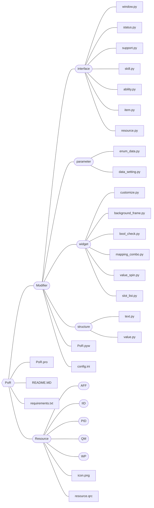

###  苍炎的轨迹 动态修改器

#### 项目说明

用于Dolphin5.0及以上版本，自动适应日文版及汉化版。

#### 项目文件结构

```mermaid
graph LR;
R{{PoR}}
m([Modifier])
r([Resource])
i([interface])
p([parameter])
s([structure])
w([widget])
R---m
R---PoR.pro
R---README.MD
R---requirements.txt
r---AFF([AFF])
r---IID([IID])
r---PID([PID])
r---QM([QM])
r---WP([WP])
r---icon.png
r---resource.qrc
m---i
m---p
m---w
m---s
m---PoR.pyw
m---config.ini
i---window.py
i---status.py
i---support.py
i---skill.py
i---ability.py
i---item.py
i---resource.py
p---enum_data.py
p---data_setting.py
s---text.py
s---value.py
w---customize.py
w---background_frame.py
w---bool_check.py
w---mapping_combo.py
w---value_spin.py
w---slot_list.py
R---r
```

